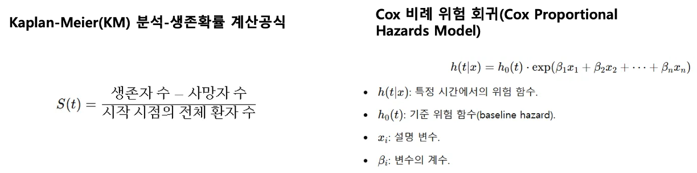
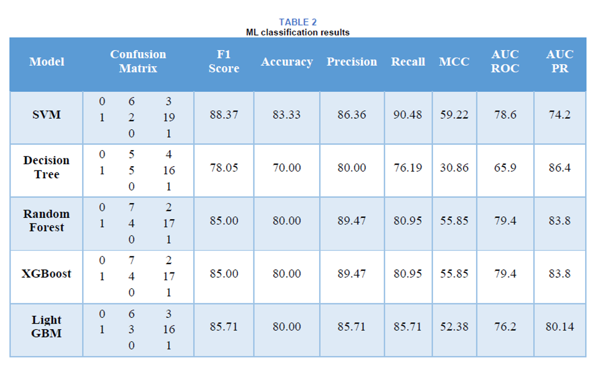

## 논문 제목 : Mishra, Saurav. "A comparative study for time-to-event analysis and survival prediction for heart failure condition using machine learning techniques." 

Journal of Electronics, Electromedical Engineering, and Medical Informatics 4.3 (2022): 115-134.

## Dataset

Faisalabad Institute of Cardiology에서 제공된 자료
299명의 심혈관 의료 기록으로 구성(모든 환자는 좌심실 수축 기능부전진단을 받았으며, 이전에 심부전을 앓은 병력이 있음.)

## 논문에서 사용한 머신러닝 알고리즘

- Support Vector Classifier (SVC):
  RBF 커널 기반 SVC의 기본 버전을 구현.

- 의사결정 트리 (Decision Tree):
  트리 구조를 기반으로 간단한 의사결정 규칙을 학습/예측.
- 랜덤 포레스트 (Random Forest):
  다수의 의사결정 트리를 결합하여 분류 결과를 다수결로 도출.
- Extreme Gradient Boosting (XGBoost):
  이전 트리의 오류를 기반으로 새로운 트리를 생성하여 강력한 예측 모델 구축.
  고속 구현과 높은 성능 제공.
- Light Gradient Boosted Machine (LightGBM):
  수직적 성장 방식을 채택하여 손실 함수를 효과적으로 줄이고 정확도를 높임.

### 하이퍼 파라미터 튜닝

- RandomizedSearchCV를 사용하여 하이퍼파라미터를 조정.
- 5-fold CV을 통해 최적의 학습 매개변수를 도출.

### 생존 분석

- 생존 분석은 특정 중재 후 일정 기간 동안 생존한 환자 수를 측정하여 중재의 효과를 평가.
- "생존 시간(Time-to-Event)"은 사건(예: 사망)이 발생하기까지의 시간을 나타내며, Kaplan-Meier(KM) 추정치와 Cox 회귀 모델을 사용하여 평가.

### 성능 재현

