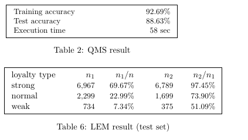

 # 논문제목 :  Quadratic Multiform Separation: A New Classification Model in Machine Learning
    - 목적 : 이차 다항식 기반 다중 클래스 분류 기법 제안
    - 주요기법 : QMS, LEM  제안 
    - 선정이유 : 응용 분류 모델 사례 중 하나로 비선형적인 분포를 선형적으로 분리하는 새로운  
    - 링크 : https://arxiv.org/abs/2110.04925
    - 코드 : https://colab.research.google.com/drive/15i7OOQhBEMcfxREOP3fypKDos4dhUa_F#scrollTo=dX5_2c87i1Vu

  
# 1. QMS Model 적용:
##### 입력 데이터를 이차 함수와 선형 함수로 처리하여 점수를 계산하는 구조 
##### 이는 논문에서 언급한 QMS의 핵심 아이디어(이차 다항식 분리를 기반으로 분류)를 반영 
 
# 2.LEM 적용:
## Loyalty Extraction Machine (LEM):  
##### 데이터 샘플을 "강한 충성도(strong)", "약한 충성도(weak)", "일반(normal)"로 구분하여 각 샘플의 예측 신뢰도를 평가
##### 충성도가 강한 샘플은 높은 예측 정확도를 보이는 반면, 약한 충성도는 정확도가 낮아 다른 방법으로 보완 가능.
##### FashionMNIST 같은 경우, 약한 충성도를 가진 샘플은 더 높은 해상도의 데이터나 추가 레이블 정보를 통해 보완 

# 3.논문실험결과:
##### Fashion MNIST 데이터셋을 사용한 실험에서 QMS는 88.63%의 테스트 정확도를 기록. 
##### 강한 충성도 샘플은 전체 테스트 데이터의 약 69.67%를 차지하며, 이 그룹에서의 예측 정확도는 매우 높음(99.82%).
##### 약한 충성도 샘플은 약 7.34%를 차지하며, 이 그룹의 정확도는 상대적으로 낮음(51.09%).
##### 일반 충성도 샘플은 나머지 22.99%를 차지하며, 이 그룹에서의 정확도는 중간 수준(73.90%).
### 해석:
##### 강한 충성도 샘플에서 높은 정확도를 유지하며 모델의 신뢰성을 강조.
##### 약한 충성도 샘플에서 성능이 떨어지는 문제를 확인하고, 추가 처리 필요성을 언급.

# 4.재현결과
### LEM을 사용하여 약한 충성도 샘플을 제거하여 QMS를 재학습시켰고, 재현결과 88%로 논문과 동일한 테스트정확도를 기록함.
```
 Epoch 1, Training Accuracy: 79.47%
 Epoch 2, Training Accuracy: 84.06%
 Epoch 3, Training Accuracy: 85.32%
 Epoch 4, Training Accuracy: 86.52%
 Epoch 5, Training Accuracy: 86.92%
 Initial Test Accuracy: 84.06%
 Filtered Data: 10000 samples (Strong + Normal Loyalty)
 Re-training model with filtered data...
 Epoch 1, Filtered Training Accuracy: 83.20%
 Epoch 2, Filtered Training Accuracy: 85.36%
 Epoch 3, Filtered Training Accuracy: 87.36%
 Epoch 4, Filtered Training Accuracy: 87.71%
 Epoch 5, Filtered Training Accuracy: 88.44%
 Test Accuracy After Re-training with Filtered Data: 88.25%
```
### 논문 결과



### 재현 결과


