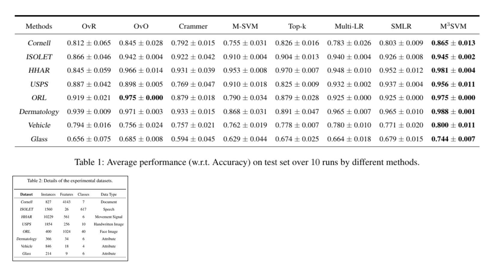
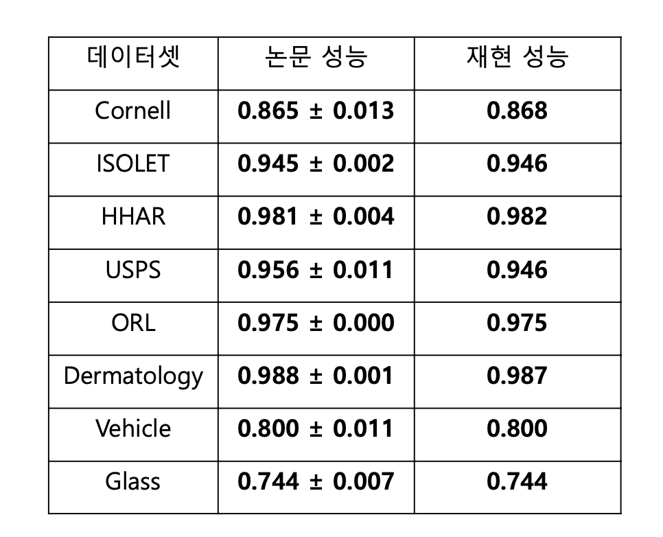

# 논문제목 : Multi-Class Support Vector Machine with Maximizing Minimum Margin
    - 목적 : 다중 클래스 분류에서 최소 마진을 최대화하는 SVM 연구
    - 주요기법 : 다중 목적 최적화 기반의 새로운 SVM 설계
    - 선정이유 : 응용 분류 모델 구현 및 개선을 위한 핵심 논문
    - 링크 : https://arxiv.org/html/2312.06578v2
    - 코드 : https://github.com/zz-haooo/m3svm

- M3SVM (Multi-class Support Vector Machine with Maximizing Minimum Margin) 모델을 제
안하여 다중 클래스 분류 문제에서 성능을 향상시키는 새로운 접근법을 소개함
- M3SVM은 클래스 간 최소 마진을 최대화하는 방식으로 설계되어, 클래스 경계를 더 명확히 하
고 높은 일반화 성능을 제공함
- M3SVM은 기존의 OvR, OvO, Crammer, M-SVM 등의 다중 클래스 SVM 모델들과 비교되었으
며, 여러 실제 데이터셋에서 더 우수한 분류 성능을 보였음

### 논문성능 재현
1. 논문 성능

2. 논문 성능재현
